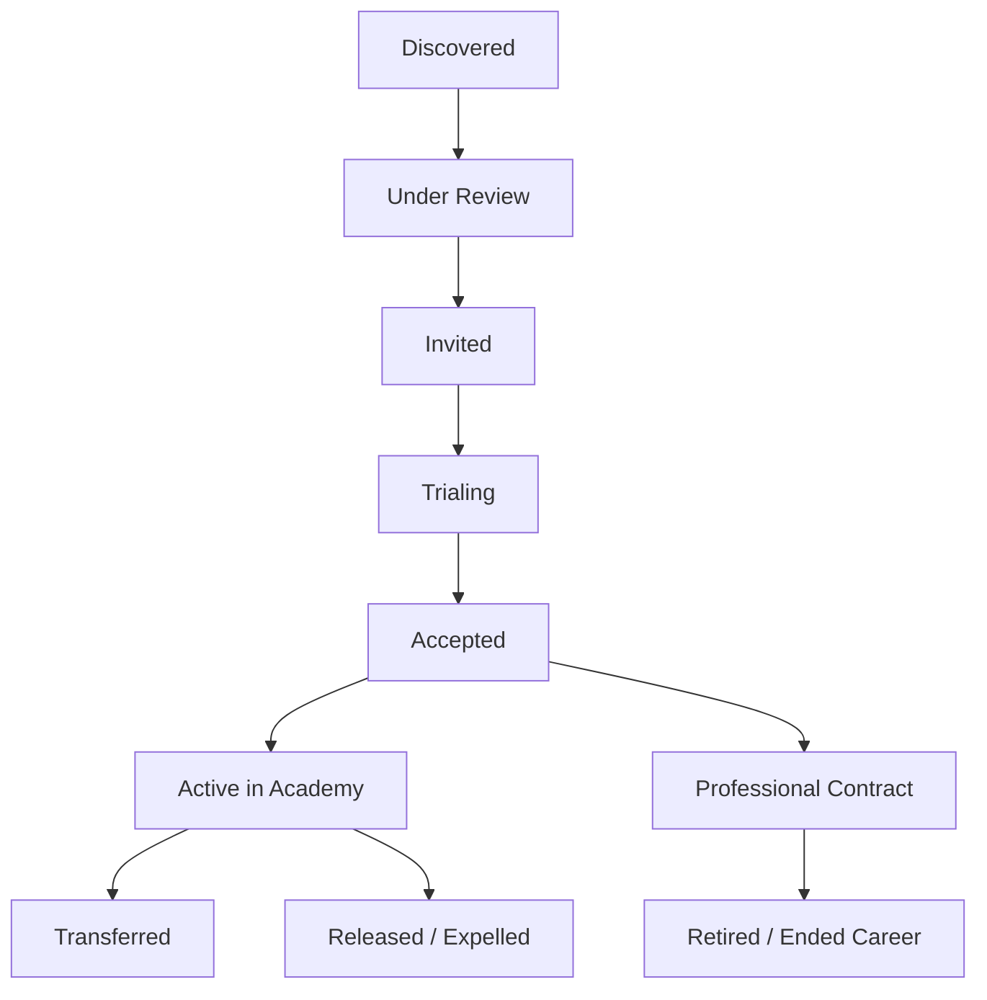

# GoalSpot
Grassroots → Academy → Professional Pipeline

FOOTBALL TALENT DISCOVERY PLATFORM
Technical Specification (TZ) + Technical Solution (TY)
Version: 1.0
## 1. PRODUCT OVERVIEW
### 1.1. Problem
O'zbekistonda ko'plab iste'dodli futbolchilar:

* ko'cha futbolida

* maktab jamoalarida

* mahalla turnirlarida

* kichik futbol markazlarida

o'ynaydi.
Ammo ular:

* akademiyalar tomonidan ko'rilmaydi

* professional skautlarga chiqolmaydi

* o'zlarini namoyish qila olmaydi

Akademiyalar esa:

* iste'dodlarni topishda qiynaladi

* saralash xarajatlari yuqori

Goal
Grassroots Football → Academy Pipeline yaratish.
Platforma:

* Player Discovery

* Community Scouting

* Coach Assessment

* Academy Recruitment

* Trial Management

jarayonlarini raqamlashtiradi.

### 1.2. USER ROLES
Guest
Unauthenticated user.
Permissions:

* View public players

* View public academies

* View public videos

* Search players

Restrictions:

* No likes

* No follows

* No recommendations

Scout
Default role after registration.
Permissions:

* Follow players

* Follow academies

* Like media

* Recommend player

* Create scout notes

* View recommendation history

Player
Additional role.
Permissions:

* Create player profile

* Upload media

* Apply for trials

* Manage statistics

* Receive recommendations

Coach
Verified role.
Permissions:

* Assess players

* Verify player skills

* Create coach reports

* Recommend players
Status:

* Pending Verification

* Verified

* Rejected

Academy Manager
Verified role.
Permissions:

* Manage academy

* Create trials

* Review recommendations

* Accept/Reject players

* Manage academy staff

Admin
Operational moderator.
Permissions:

* Verify coaches

* Verify academies

* Moderate media

* Moderate users

* Handle reports

Restrictions:

* Cannot create admins

* Cannot access system settings

Super Admin
Highest role.
Permissions:

* CRUD Admins

* CRUD Roles

* CRUD Permissions

* Manage Platform Settings

* View Audit Logs

* Access All Data

* Manage Feature Flags


### 1.3. AUTHENTICATION
Supported methods:
Method 1
Phone + OTP
Flow:
Phone
→ Send OTP
→ Verify OTP
→ Login
Method 2
Email + Password
Flow:
Email
→ Password
→ Login
Security:

* Argon2 Hashing

* Password Reset

Method 3
OAuth
Providers:

* Google

* Facebook

* OneID

* Apple (future)

Flow:
OAuth Login
→ Account Linking

### 1.4. AUTHORIZATION
RBAC
Tables:
users
roles
permissions
user_roles
role_permissions

### 1.5. SCOUT REPUTATION SYSTEM
Purpose:
Prevent spam recommendations.
Metrics
total_recommendations
accepted_recommendations
success_rate
Formula:
success_rate =
accepted_recommendations /
total_recommendations * 100
Scout Levels
Level 1 - Observer
Requirements:
0-5 recommendations
No success requirement
Weight = 1
Level 2 - Spotter
Requirements:
5+ recommendations
10%+ success rate
Weight = 2
Level 3 - Talent Hunter
Requirements:
20+ recommendations
20%+ success rate
Weight = 3
Level 4 - Elite Scout
Requirements:
50+ recommendations
30%+ success rate
Weight = 4
Level 5 - Master Scout
Requirements:
100+ recommendations
40%+ success rate
Weight = 5
Level 6 - Legendary Scout
Requirements:
250+ recommendations
50%+ success rate
Weight = 6

### 1.6. PLAYER PROFILE
Fields
Personal:

* first_name

* last_name

* birth_date

* gender

Physical:

* height

* weight

Football:

* dominant_foot

* primary_position

* secondary_position

Location:

* region

* district

Statistics:

* matches

* goals

* assists

* clean_sheets

* sprint_time

* juggling_record


### 1.7. MEDIA SYSTEM
Supported:

* Images

* Videos

Categories:

* Dribbling

* Passing

* Shooting

* Sprint

* Match Highlights

Storage:
Cloudflare R2
Metadata stored in PostgreSQL.

### 1.8. RECOMMENDATION SYSTEM
Scout selects:
Player
→ Academy
→ Recommendation
Status:
PENDING
REVIEWING
ACCEPTED
REJECTED
Acceptance affects:
Scout Reputation
Scout Level
Scout Weight

### 1.9. COACH ASSESSMENT
Assessment Categories:
Speed
Passing
Vision
Dribbling
Finishing
Physical
Leadership
Discipline
Rating:
1-10
Coach can attach:

* Notes

* Media

* Documents


### 1.10. ACADEMY MANAGEMENT
Academy Registration
Request
→ Admin Review
→ Approved
Academy Structure
Academy
Academy Manager
Academy Coaches
Academy Scouts

### 1.11. TRIAL MANAGEMENT
Academy creates:
Trial
Fields:

* title

* age_range

* positions

* location

* date

* requirements

Player applies.
Statuses:
Applied
Shortlisted
Invited
Rejected
Accepted

### 1.12. NOTIFICATION SYSTEM
Real-time
WebSocket
Events:

* Recommendation Accepted

* Recommendation Rejected

* Trial Invitation

* Trial Result

* Verification Result


### 1.13. MODERATION SYSTEM
Admin reviews:

* Fake profiles

* Fake academies

* Fake coaches

* Inappropriate media

* Spam recommendations

Reports:
User Report
Media Report
Academy Report
Coach Report

### 1.14. DATABASE DESIGN
Core Tables
users
roles
permissions
user_roles
role_permissions
player_profiles
coach_profiles
academy_profiles
academy_members
media
media_likes
media_views
media_comments
recommendations
recommendation_statuses
coach_assessments
trials
trial_applications
notifications
audit_logs

### 1.15. BACKEND ARCHITECTURE
Framework:
NestJS
Architecture:
Modular Monolith
Modules:
Auth
Users
Players
Coaches
Academies
Media
Recommendations
Trials
Notifications
Moderation
Admin
RBAC
Audit

### 1.16. FRONTEND ARCHITECTURE
Framework:
Next.js
UI:
TailwindCSS
shadcn/ui
State:
TanStack Query
Zustand
Forms:
React Hook Form
Zod

### 1.17. WEBSOCKET ARCHITECTURE
NestJS Gateway
Redis Adapter
Used only for:
Notifications
Trial Updates
Recommendation Updates
Verification Updates
Not used for:
Likes
Views
Profile Visits

### 1.18. QUEUE SYSTEM
BullMQ
Redis
Jobs:
Video Processing
Thumbnail Generation
Notification Delivery
Recommendation Score Recalculation
Scout Level Recalculation
Email Delivery

### 1.19. CACHING
Redis
Cache:
Player Profile
Academy Profile
Leaderboard
Scout Rankings
Recommendation Rankings

### 1.20. SCALABILITY
Goal:
Horizontal Scaling Ready
Principles:
Stateless API
JWT Authentication
Shared Redis
Shared PostgreSQL
Shared Object Storage
Future:
Load Balancer
Nginx
Multiple NestJS Instances

### 1.21. SECURITY
JWT
Refresh Tokens
OTP Rate Limiting
Device Tracking
Audit Logs
IP Monitoring
Suspicious Activity Detection
CSRF Protection
XSS Protection
Input Validation

### 1.22. ANALYTICS
Metrics:
Total Players
Total Scouts
Total Coaches
Total Academies
Recommendations
Acceptance Rate
Trials
Applications
Academy Conversion Rate
Top Scouts
Top Players

### 1.23. MVP SCOPE
Included
Authentication
RBAC
Player Profiles
Academy Profiles
Scout Recommendations
Coach Assessments
Trial Management
Notifications
Moderation
Admin Panel
Excluded
Chat
Payments
Live Streaming
Transfer Market
AI Video Analysis
Mobile Apps
Fantasy Football

### 1.24. SUCCESS KPI
Month 6
Players: 1000+
Scouts: 500+
Coaches: 100+
Academies: 50+
Recommendations: 5000+
Accepted Players: 100+
Primary KPI:
Number of players successfully accepted into academies through the platform.
 
## 2. ACADEMY ADMISSION PROCESS (REAL-WORLD MODEL)
#### Overview
Akademiyaga qabul qilish jarayoni har doim ham ommaviy sinov (open trial) orqali bo‘lavermaydi. Amaliyotda bir nechta turli recruitment yo‘llari mavjud.
---
### 2.1. OPEN TRIAL (Ommaviy sinov)
#### Tavsif
Akademiya e’lon beradi va barcha nomzodlar qatnashadi.
#### Jarayon
- Ro‘yxatdan o‘tish
- Jismoniy testlar
- Kichik o‘yinlar
- Murabbiy bahosi
#### Natija
- Qabul
- Rad etish
- Kutish ro‘yxati
---
### 2.2. PRIVATE INVITATION (Shaxsiy taklif)
#### Tavsif
Akademiya futbolchini oldindan tanlab, individual ko‘rikka chaqiradi.
#### Manba
- Scout tavsiyasi
- Coach bahosi
- Video/analytics
#### Jarayon
- Individual trening
- Baholash
- Qaror
---
### 2.3. SCOUT RECOMMENDATION
#### Tavsif
Community scout yoki oddiy foydalanuvchi futbolchini tavsiya qiladi.
#### Shart
- Reputation score muhim
- Academy review qiladi
---
### 2.4. COACH RECOMMENDATION
#### Tavsif
Tasdiqlangan murabbiy futbolchini baholaydi va tavsiya qiladi.
#### Og‘irlik
Scout tavsiyasidan yuqori prioritetga ega.
---
### 2.5. DIRECT RECRUITMENT
#### Tavsif
Akademiya futbolchini bevosita kuzatib, sinovsiz taklif qiladi.
#### Manba
- Turnirlar
- Video scouting
- Oldingi natijalar
---
#### PLAYER STATUS FLOW
- DISCOVERED
- UNDER_REVIEW
- INVITED
- TRIALING
- ACCEPTED
- REJECTED
- WATCHLIST
---
#### KEY INSIGHT
Akademiya qabul jarayoni faqat trial emas, balki:
- scouting
- recommendation
- video analysis
- direct selection
asosida ishlaydigan pipeline hisoblanadi.

## 3. YANGI BO‘LIM: POST-ACCEPTANCE PLAYER LIFECYCLE

### 3.1 Player Status Flow (To‘liq)



### 3.2 Post-Acceptance Entities

**New Table: `player_academy_histories`**

| Field                        | Type     | Description |
|-----------------------------|----------|-----------|
| id                          | uuid     | - |
| player_id                   | uuid     | - |
| academy_id                  | uuid     | - |
| joined_date                 | date     | - |
| left_date                   | date     | null bo'lsa hali faol |
| status                      | enum     | ACTIVE, TRANSFERRED, RELEASED, EXPELLED, GRADUATED |
| transfer_reason             | text     | ixtiyoriy |
| professional_contract       | boolean  | - |
| contract_start              | date     | - |
| contract_end                | date     | - |
| club_name                   | string   | Professional club nomi |
| league                      | string   | (Uzbekistan Super League, Pro League, etc.) |

---

## 4. PROFESSIONAL TRANSITION MODULE (Yangi)

### 4.1 Professional Player Dashboard ("Pro Window")

**Alohida bo‘lim yaratiladi** — **"Professional Players"**

**Player uchun:**

- "Pro" badge (oltin rangli)
- Professional club, league, jersey number
- Career timeline (Academy → Pro)
- Statistics sync (future)
- Scout/Coaches who contributed visible

**Scout uchun:**

- "Legendary Scout" yoki "Pro Producer" badge
- Har bir professionalga chiqargan o‘quvchisi uchun maxsus hisob

**Academy uchun:**

- "Pro Factory" badge
- "Graduated Players" counter + list
- Conversion rate to professional (%)

**Coach uchun:**

- "Pro Coach" badge
- His contribution visible

---

## 5. SCOUT REPUTATION & REWARD SYSTEM (Kengaytirilgan)

#### Yangi metriklar qo‘shiladi:

| Metric                        | Weight | Description |
|------------------------------|--------|-----------|
| `accepted_recommendations`   | +1     | Oldingi |
| `professional_developments`  | +5     | Player professionalga chiqsa |
| `long_term_success`          | +3     | 1 yildan keyin hali akademiyada qolsa |

**Yangi Scout Levels (yuqori darajalar):**

- **Level 7 – Pro Scout**
- **Level 8 – Elite Producer**
- **Level 9 – Legend Maker**

**Formula yangilash:**
```sql
total_score = (accepted * 1) + (professional * 8) + (still_active_after_12m * 2)
```

---

## 6. BADGE SYSTEM

### Global Badges

**Player:**
- **Pro Debut** (Birinchi professional o‘yin)
- **Academy Graduate**
- **Fast Tracker**

**Scout:**
- **First Pro Recommendation**
- **Multiple Pro Producer**
- **Talent Whisperer**

**Academy:**
- **Pro Factory**
- **Best Talent Developer**
- **Highest Conversion Rate**

**Coach:**
- **Pro Coach**
- **Player Developer**

Badges `badges` va `user_badges` / `academy_badges` / `coach_badges` jadvallarida saqlanadi.

---

## 7. TRANSFER & RELEASE MANAGEMENT

**Academy Manager huquqlari qo‘shiladi:**

- Playerni "Transfer" qilish
- Playerni "Release / Expel" qilish (sababi bilan)
- "Graduated to Professional" belgilash

**Tizim avtomatik qiladigan ishlar:**

1. `player_academy_histories` ga yozuv qo‘shish
2. Tegishli scout(lar)ga **+5** og‘irlik berish
3. Tegishli coach(lar)ga badge berish imkoniyati
4. Player profilida "Career Path" bo‘limini yangilash
5. Notification barcha ishtirokchilarga (scout, coach, player, academy)

---

## 8. RECOMMENDATION VALUE (LONG-TERM)

Endi bitta recommendationning qiymati vaqt o‘tishi bilan o‘zgaradi:

- Qabul qilinganda: **+1**
- 6 oy akademiyada qolsa: **+2**
- 12 oy akademiyada qolsa: **+3**
- Professionalga chiqsa: **+8**

---

### 9. MVP + Phase 2 (Yangilangan)

**MVP (v1.0) da qoladi**  
**Phase 1.5 / Phase 2 ga qo‘shiladi:**

- Player Academy History
- Professional Transition Module
- Advanced Badge System
- Long-term Scout Impact Tracking
- Transfer & Release Workflow

---

## 10. DATABASE Qo‘shimcha Jadvallar

- `player_academy_histories`
- `player_career_milestones`
- `badges`
- `user_badges`
- `academy_badges`
- `scout_impact_records`

---

**Xulosa:**

Endi platforma faqat **talent discovery** emas, balki **to‘liq futbolchi rivojlanish pipeline**i bo‘ladi:

**Grassroots → Academy → Professional**

Bu o‘zbek futboli uchun juda muhim farq yaratadi, chunki scout va akademiyalar o‘zlarining **uzoq muddatli ta’sirini** ko‘ra oladilar va rag‘batlanadilar.
