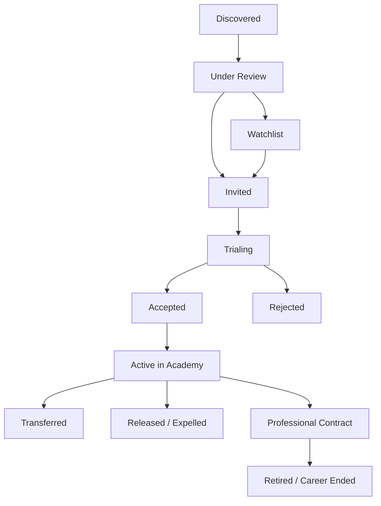

# FotSpot

**Grassroots → Academy → Professional pipeline for Uzbek football.**

Technical Specification (TZ) + Technical Solution (TY) · Version 2.0

> **Document contract.** Section numbers in this file are load-bearing:
> [`backend/README.md`](./backend/README.md) and [`backend/CLAUDE.md`](./backend/CLAUDE.md)
> reference §1.5, §1.15, §1.17, §1.20, §1.23 and "sections 3–8 / section 9" by number.
> Renumbering §1–§10 breaks those references. New material is appended as §11+.
>
> **Language.** This spec is written in English (matching the rest of the repo's docs and code).
> The _product_ ships in Uzbek (Latin), Russian and English — see §14.

---

## Table of contents

| §                                                                               | Topic                                             | Status                                        |
| ------------------------------------------------------------------------------- | ------------------------------------------------- | --------------------------------------------- |
| [1](#1-product-overview)                                                        | Product overview & MVP spec                       | **MVP — API implemented, client pending**     |
| [2](#2-academy-admission-process-real-world-model)                              | Real-world admission paths                        | MVP (informs modelling)                       |
| [3](#3-post-acceptance-player-lifecycle)–[8](#8-recommendation-value-long-term) | Post-acceptance lifecycle, pro transition, badges | **Phase 2 — deferred**                        |
| [9](#9-scope-mvp-vs-phase-15--phase-2)                                          | Scope split                                       | Reference                                     |
| [10](#10-phase-2-additional-tables)                                             | Phase 2 tables                                    | Reference                                     |
| [11](#11-trust-safety--minor-protection)                                        | Trust, safety & minor protection                  | **Phase 1.5 — required before public launch** |
| [12](#12-anti-fraud--data-integrity)                                            | Anti-fraud & data integrity                       | Phase 1.5                                     |
| [13](#13-fotspot-combine--player-index)                                         | Combine tests & Player Index                      | Phase 1.5 (key differentiator)                |
| [14](#14-localization-access--low-bandwidth-design)                             | Localization & low-bandwidth                      | Phase 1.5                                     |
| [15](#15-business-model--monetization)                                          | Business model & monetization                     | Phase 2+                                      |
| [16](#16-go-to-market--the-cold-start-problem)                                  | GTM & cold start                                  | Ongoing                                       |
| [17](#17-roadmap)                                                               | Roadmap                                           | Ongoing                                       |
| [18](#18-metrics--instrumentation)                                              | Metrics & instrumentation                         | Ongoing                                       |
| [19](#19-risks--mitigations)                                                    | Risks                                             | Ongoing                                       |
| [20](#20-explicit-non-goals)                                                    | Explicit non-goals                                | Permanent                                     |
| [21](#21-player-experience--card-system)                                        | Player cards & UX (eFootball-style)               | Phase 1.5 (player retention)                  |

## 1. PRODUCT OVERVIEW

### 1.1. Problem

Talented young footballers in Uzbekistan play in street football, school teams, _mahalla_
tournaments and small football centres — but they are invisible to academies, unreachable by
professional scouts, and have no way to present themselves. Academies, from the other side,
struggle to _find_ talent and carry high selection costs (travel, open-trial logistics, wasted
scouting days).

Both sides lose to the same thing: **there is no shared, trustworthy, searchable record of who
plays and how well.**

**Goal.** Digitise the grassroots → academy pipeline: Player Discovery, Community Scouting,
Coach Assessment, Academy Recruitment, Trial Management.

### 1.2. User roles

| Role                | How obtained            | Core permissions                                                                                                    | Cannot                                  |
| ------------------- | ----------------------- | ------------------------------------------------------------------------------------------------------------------- | --------------------------------------- |
| **Guest**           | unauthenticated         | View public players / academies / media, search players                                                             | Like, follow, recommend                 |
| **Scout**           | default on registration | Follow players & academies, like media, recommend a player, scout notes, history                                    | Assess players, manage academies        |
| **Player**          | additional role         | Create player profile, upload media, apply for trials, manage stats                                                 | Recommend, assess                       |
| **Coach**           | verified role           | Assess players, verify skills, coach reports, recommend                                                             | Manage academies                        |
| **Academy Manager** | **assigned by an admin** when the academy is created (§1.10) | Manage their academy, create trials, review recommendations, accept/reject, manage staff, **follow/mute scouts** (§1.5.2) | **Create an academy**, verify other academies |
| **Admin**           | granted by super admin  | Verify coaches & academies, moderate media/users, handle reports                                                    | Create admins, change platform settings |
| **Super Admin**     | bootstrap / seeded      | CRUD admins, roles, permissions; platform settings; audit logs; feature flags                                       | —                                       |

Coach and Academy Manager statuses: `PENDING_VERIFICATION → VERIFIED | REJECTED`.
A user may hold several roles (a coach is usually also a scout).

### 1.2.1. Active role & persistence

A user holding several roles has exactly one **active role** at a time. It selects _which product
they see_ — a player sees their card and trials, an academy manager sees the recommendation inbox.

**Rule: the active role is restored to whatever it last was.** It must survive a page refresh, a
full logout → login, and moving to a different device. A user who works as an academy manager every
day should never land in the scout view again after logging back in.

| Concern                      | Rule                                                                                                                                                                                                      |
| ---------------------------- | --------------------------------------------------------------------------------------------------------------------------------------------------------------------------------------------------------- |
| Storage                      | `users.last_active_role`, server-side — so it follows the account, not the browser. Mirrored into a cookie so the first server render is already correct without waiting on an API call.                  |
| Survives logout              | **Yes, deliberately.** The cookie is not cleared on logout; the value is a role name, not a credential.                                                                                                   |
| On restore                   | Validate against the roles the user _currently_ holds. A coach whose verification was later rejected falls back to the highest-priority role they still have, silently.                                   |
| Priority for a fresh account | `super_admin → admin → academy_manager → coach → player → scout` — the most specific role wins, since it is the one with a purpose-built dashboard.                                                       |
| Never                        | Do not use the active role for authorization. It is a **view preference**. Every permission decision uses the JWT claims and the backend guards (§1.4). A tampered cookie must change nothing but layout. |

### 1.2.2. First-login role discovery ("are you a player?")

Registration grants `scout` by default (§1.2), which is wrong for a large share of signups: a
15-year-old joining to _be seen_ is not a scout. The platform has to ask — and _how_ it asks
decides whether the primary supply side ever completes a profile.

**Rule: ask once, on a dedicated welcome route immediately after the first login — never in the
signup form, never in a modal.**

```
first login  →  /welcome  →  "What brings you to FotSpot?"
                              ┌──────────────────┐  ┌──────────────────┐
                              │  ⚽ I play       │  │  🔍 I spot       │
                              │  football        │  │  talent          │
                              └──────────────────┘  └──────────────────┘
                              [ I'll decide later ]
```

Why this shape, having rejected the alternatives:

| Option                                 | Verdict                                                                                                                                                                                 |
| -------------------------------------- | --------------------------------------------------------------------------------------------------------------------------------------------------------------------------------------- |
| Role picker **inside the signup form** | ✗ Adds a decision before the user has seen any value — the most expensive place to put friction. Also unanswerable for the common "parent registering for a son" case.                  |
| **Blocking modal** over the dashboard  | ✗ A modal over an empty dashboard gives no context to decide, traps mobile keyboards, and reads as an interrogation. Dismissal is the likely outcome, and then it is never asked again. |
| **Dedicated welcome route** _(chosen)_ | ✓ The user has just arrived with intent. Full-screen means large touch targets for §14's target device. Being a real route makes it linkable, back-button-safe and testable.            |
| Behavioural inference only             | ✗ Too slow on its own — but see the fallback below, where it is genuinely the right mechanic.                                                                                           |

Rules attached to it:

- **Asked once per account, not per device.** The prompt state lives on the user record
  (`onboarding_completed_at`), so a second phone doesn't re-ask.
- **"I play football" adds the `player` role, it does not replace `scout`** (§1.2 — roles
  accumulate). The user keeps their scouting abilities.
- **Skipping is free and non-terminal.** A skipped welcome becomes a dismissible card on the
  dashboard, and the question returns _just-in-time_ the moment the user attempts something
  player-only ("Uploading a video needs a player profile — create one?"). Behavioural inference is
  the right fallback precisely because that moment carries its own motivation.
- **The player path is age-gated first** (§11.1). Birth date is the _first_ question after choosing
  "I play", and an under-18 answer routes into the guardian-consent flow before anything else is
  collected. Never collect a minor's media, position or stats before consent exists.

### 1.2.3. Switching between roles

For multi-role users, switching must be one tap from anywhere.

- **A persistent role switcher in the app header**, showing the active role and every other role
  the user holds. Not buried in a settings page.
- Roles still awaiting verification appear **disabled with their status** (`Coach · pending
review`) rather than being hidden — an invisible pending role generates support questions.
- Switching **only changes the view**, never privileges (§1.2.1). The JWT already carries every
  role at once, so switching costs no round trip and needs no token refresh.
- Switching **persists immediately** as the new `last_active_role`, so the next login lands there.
- A single-role user sees **no switcher at all** — it would be chrome that explains nothing.
- Anything genuinely role-specific and destructive stays gated by the backend regardless of the
  active role; the switcher never becomes a privilege-escalation surface.

### 1.3. Authentication

| Method               | Flow                              | Notes                                                                                   |
| -------------------- | --------------------------------- | --------------------------------------------------------------------------------------- |
| **Phone + OTP**      | phone → send OTP → verify → login | Primary method in UZ. Rate-limited (§1.21). SMS gateway is a stub — see backend README. |
| **Email + password** | email → password → login          | Argon2 hashing, password reset flow.                                                    |
| **OAuth**            | provider login → account linking  | Google, Facebook, OneID. Apple deferred. Token verification is a stub.                  |

Sessions: short-lived JWT access token + rotating refresh token, device-bound (§1.21).

### 1.4. Authorization

RBAC over five tables: `users`, `roles`, `permissions`, `user_roles`, `role_permissions`.
Effective access is resolved at login/refresh and embedded as JWT claims. Guard order in
`app.module.ts` is `JwtAuthGuard → RolesGuard → PermissionsGuard` and is load-bearing.

### 1.5. Scout reputation system

**Purpose:** make recommendations cost something, so the signal stays clean.

```
success_rate = accepted_recommendations / total_recommendations * 100
```

| Level | Name            | Min recommendations | Min success rate | Proven placements¹ | Weight  |
| ----- | --------------- | ------------------- | ---------------- | ------------------ | ------- |
| 1     | Observer        | 0                   | —                | 0                  | **1**   |
| 2     | Spotter         | 5                   | 10%              | 1                  | **3**   |
| 3     | Talent Hunter   | 20                  | 20%              | 4                  | **8**   |
| 4     | Elite Scout     | 50                  | 30%              | 15                 | **20**  |
| 5     | Master Scout    | 100                 | 40%              | 40                 | **50**  |
| 6     | Legendary Scout | 250                 | 50%              | 125                | **125** |

¹ _Proven placements_ = `min_recommendations × min_success_rate` — the minimum number of players
this scout has actually put into an academy to reach the tier.

**Why the weights are geometric, not linear.** The tiers' difficulty is already geometric
(0 → 1 → 4 → 15 → 40 → 125 real placements), so linear weights 1…6 were unfair in both
directions: they under-paid a Legendary Scout who had placed 125 children, and they let six
brand-new accounts — which cost six phone numbers and five minutes — outrank them. Weight now
tracks proven placements, so a tier's weight is roughly what it cost to earn.

An Observer's weight of **1** is correct as an absolute floor: level 1 has _no_ success
requirement, so an Observer's success rate is unknown and their recommendation carries no
evidence beyond "somebody looked".

### 1.5.1. Aggregating multiple recommendations

Weight alone is not enough — summing it linearly means 125 fake Observers still equal one
Legendary Scout. Recommendations for the same player are therefore aggregated with
**diminishing returns**: sort them by weight descending and discount by position.

```
credibility = Σ (w₍ₖ₎ / k)   for k = 1…n,  w₍₁₎ ≥ w₍₂₎ ≥ … ≥ w₍ₙ₎
```

| Backing a player            | Credibility |
| --------------------------- | ----------- |
| 1 Legendary Scout           | 125         |
| 6 Observers                 | 2.45        |
| 125 Observers               | 5.41        |
| 5 Talent Hunters            | 18.27       |
| 1 Legendary + 1 Elite Scout | 135         |

The harmonic discount grows like `ln(n)`, so manufacturing accounts yields almost nothing,
while genuine corroboration by credible scouts still adds real signal. Only recommendations
from scouts that pass the independence checks in §12.2 (distinct household, device and
network) count as separate terms — the rest collapse into one.

A **verified coach**'s recommendation (§2.4) enters this sum at a floor of **20**, regardless of
scout level: a coach is identity-verified and professionally accountable, which is a different
kind of evidence from community volume.

### 1.5.2. Academy → scout following (per-academy trust)

§1.5's weight is _objective_ reputation: the same number for everybody. But an academy in Fergana
that has twice signed players found by a local school coach trusts that coach more than the
platform average says it should — and an academy that keeps rejecting a particular scout's
suggestions wants to stop seeing them.

So an **Academy Manager can follow (or mute) a scout**, and that relationship scales the scout's
weight _inside that academy's ranking only_.

```
academy_weight(scout, academy) = weight(scout) × trust(scout, academy)
```

| Academy's relationship to the scout                                              | `trust` |
| -------------------------------------------------------------------------------- | ------- |
| **Muted** — academy chose to suppress this scout                                 | 0.25    |
| **None** — default                                                               | 1.0     |
| **Followed** — explicit, manual                                                  | 1.5     |
| **Trusted** — followed _and_ ≥3 recommendations already accepted from this scout | 2.0     |

The result feeds into §1.5.1's credibility sum in place of the raw weight. `trust` is **capped at
2.0**, and that cap is not arbitrary:

> **Trust can never promote a scout a full tier.** Every step in the §1.5 weight ladder is a
> factor of ≥2.5 (1 → 3 → 8 → 20 → 50 → 125), so a doubled scout always lands _below_ the next
> tier's base weight: a trusted Talent Hunter reaches 16 against an untrusted Elite Scout's 20;
> a trusted Master Scout reaches 100 against a Legendary's 125.

An academy can therefore reorder its own inbox by conviction, but it cannot manufacture
credibility. A followed Observer is worth 1.5 — still nothing against a Legendary Scout's 125.

**Hard boundary: following does not touch global reputation.** `total_recommendations`,
`accepted_recommendations`, `success_rate`, level and global `weight` (§1.5) are computed from raw
outcomes only. Following affects exactly three things: ordering inside that academy's
recommendation inbox, that academy's alerts, and nothing else. Without this separation a scout
could lobby academies into following them, rank higher, get accepted more, and inflate their
_global_ level — a feedback loop that would corrupt the reputation system for everyone.

**What following is actually for** (the ranking boost is the smaller half):

- **A scout network per academy** — "12 scouts we trust", the academy's own private talent radar.
- **Alerts** — "3 scouts you follow recommended players this week", the thing that brings an
  academy manager back into the product weekly.
- **A reward loop for scouts** — a scout sees _which_ academies follow them. For an unpaid
  volunteer coach, "4 academies follow my recommendations" is real status, and it costs nothing
  to give.
- **Mute is the underrated half** — an academy drowning in low-quality suggestions currently has
  no remedy except ignoring them. Muting keeps them in the product instead of churning.

Note that **mute suppresses, it does not delete**: a muted Legendary Scout still lands at 31.25,
low in the list but visible. An academy that has decided it dislikes a scout should not be able to
blind itself to the platform's single strongest signal — 125 children placed is evidence the
academy's opinion doesn't erase. Muting a low-tier scout, where the annoyance actually lives,
drops them to 0.25 and effectively out of sight.

Model: `academy_scout_follows` (`academy_id`, `scout_id`, `state ∈ {FOLLOWING, MUTED}`,
`created_at`, unique on the pair). Mutes are private to the academy — never shown to the scout,
who simply sees no signal either way. Publicising a mute would be a punishment the scout can't
appeal and can't learn from.

> **Frozen.** The `success_rate` formula, the six tier names, and the recommendation/success-rate
> thresholds are copied verbatim into `backend/src/recommendations/scout-level.util.ts`.
> Changing them is a product decision, not a refactor. The **weights** were revised (v2.0) from
> a linear 1–6 scale by owner decision, and `scout-level.util.ts` was updated in the same change
> — the two must never diverge. Anti-gaming rules that _surround_ the formula (rate limits,
> decay, duplicate detection) live in §12 and may evolve freely.

### 1.6. Player profile

- **Personal** — `first_name`, `last_name`, `birth_date`, `gender`
- **Physical** — `height`, `weight` (with `measured_at`, so growth is a curve, not a fact)
- **Football** — `dominant_foot`, `primary_position`, `secondary_position`, `playing_style` (§21.3)
- **Location** — `region`, `district`
- **Self-reported statistics** — `matches`, `goals`, `assists`, `clean_sheets`, `sprint_time`,
  `juggling_record`

> Self-reported stats are displayed as **unverified** until they are confirmed by a coach
> assessment (§1.9) or a Combine result (§13). Never mix the two in the same UI number —
> that distinction is the platform's core credibility.

### 1.7. Media system

Images and videos, categorised: Dribbling · Passing · Shooting · Sprint · Match Highlights.
Storage on Cloudflare R2 (S3-compatible), metadata in PostgreSQL. Upload is via presigned
PUT (stubbed in the MVP). Transcoding/duration limits: §14.

### 1.8. Recommendation system

Scout selects a player → selects an academy → submits a recommendation.

`PENDING → REVIEWING → ACCEPTED | REJECTED` (academy-manager-only transitions)

Outcome updates the scout's reputation, level and weight (§1.5) and fires notifications (§1.12).

### 1.9. Coach assessment

Categories rated 1–10: Speed · Passing · Vision · Dribbling · Finishing · Physical ·
Leadership · Discipline. A coach may attach notes, media and documents. Only a `VERIFIED`
coach profile may submit an assessment.

### 1.10. Academy management

**Academies are created by an admin, not self-registered** (revised — see the note below).
Structure: Academy → Academy Manager → Academy Coaches → Academy Scouts (`academy_members`
with role + status).

> **Revised from `Request → Admin review → Approved`.** Uzbekistan has roughly **50 football
> academies in total**. At that scale a self-service registration queue is more attack surface
> than convenience: nearly every submission would be a duplicate or a fake, and each one is an
> institution asking for access to children (§11). So an admin or super admin creates the
> academy record and names its manager, who is granted `academy_manager` at that moment.
> Because a human has already vetted it, an admin-created academy starts `VERIFIED` — there is
> no second reviewer to wait for. A prospective academy contacts the platform team instead of
> filling in a form.
>
> This does not change what an Academy Manager *does* once assigned (§1.11, §1.5.2); it only
> changes who brings the academy into existence.

### 1.11. Trial management

Academy creates a trial (`title`, `age_range`, `positions`, `location`, `date`, `requirements`).
Players apply; the application moves `Applied → Shortlisted → Invited → Rejected | Accepted`.
Age is validated against the player's `birth_date` at the trial `date`.

### 1.12. Notification system

Realtime over WebSocket, persisted in `notifications`. Events: recommendation accepted/rejected,
trial invitation, trial result, verification result. Every WS push has a persisted row —
they must never diverge.

### 1.13. Moderation system

Admin review queues for fake profiles / academies / coaches, inappropriate media, and spam
recommendations. Report types: user, media, academy, coach. See §11 for the minor-safety
obligations layered on top.

### 1.14. Database design

Core tables: `users`, `roles`, `permissions`, `user_roles`, `role_permissions`,
`player_profiles`, `coach_profiles`, `academy_profiles`, `academy_members`, `media`,
`media_likes`, `media_views`, `media_comments`, `recommendations`, `recommendation_statuses`,
`coach_assessments`, `trials`, `trial_applications`, `notifications`, `audit_logs`.

Phase 2 tables are listed once, in §10.

> **Implemented.** `follows` (scout → player/academy, polymorphic over `target_type`) and
> `academy_scout_follows` (§1.5.2, FOLLOWING/MUTED) both exist in the backend, alongside
> `sessions` (§1.21 device tracking), `media_views` and `media_comments`. See
> [`backend/README.md`](./backend/README.md) for what each one does and what is still missing.

### 1.15. Backend architecture

NestJS **modular monolith**. Modules: Auth · Users · Players · Coaches · Academies · Media ·
Recommendations · Trials · Notifications · Moderation · Admin · RBAC · Audit.
Persistence: Prisma + PostgreSQL 16. Details and rationale: [`backend/CLAUDE.md`](./backend/CLAUDE.md).

### 1.16. Frontend architecture

Next.js (App Router) · TailwindCSS · shadcn/ui · TanStack Query · Zustand ·
React Hook Form + Zod. Details: [`client/CLAUDE.md`](./client/CLAUDE.md).

The player-facing surface is card-driven (§21) — the `PlayerCard` component is the single most
important thing the frontend builds, and every other player screen is secondary to it.

### 1.17. WebSocket architecture

NestJS Gateway with a Redis adapter (adapter wired when >1 instance exists).

- **Used for:** notifications, trial updates, recommendation updates, verification updates.
- **Not used for:** likes, views, profile visits — these are high-volume, low-value events;
  they are counted and read from cache, never pushed.

### 1.18. Queue system

BullMQ on Redis. Jobs: video processing, thumbnail generation, notification delivery,
recommendation score recalculation, scout level recalculation, email/SMS delivery.

### 1.19. Caching

Redis, for: player profile, academy profile, leaderboards, scout rankings, recommendation
rankings. Nothing lives only in Redis — everything is reconstructible from Postgres.

### 1.20. Scalability

Stateless API + JWT + shared Redis/Postgres/object storage → horizontally scalable.
Later: Nginx/load balancer in front of multiple NestJS instances. Read replicas only when
a measured read bottleneck exists, not preemptively.

### 1.21. Security

JWT + refresh-token rotation · OTP rate limiting · device tracking · audit logs ·
IP monitoring · suspicious-activity detection · CSRF · XSS · input validation on every DTO.
Minor-specific requirements are in §11 and are **not optional**.

### 1.22. Analytics

Counts and rates: players, scouts, coaches, academies, recommendations, acceptance rate,
trials, applications, academy conversion rate, top scouts, top players.
The metric _tree_ (what actually drives the business) is §18.

### 1.23. MVP SCOPE

**Included:** Authentication · RBAC · Player Profiles · Academy Profiles · Scout
Recommendations · Coach Assessments · Trial Management · Notifications · Moderation ·
Admin Panel.

**Excluded from MVP:** Chat · Payments · Live Streaming · Transfer Market · AI Video
Analysis · Mobile Apps · Fantasy Football.

> Several "excluded" items return deliberately later — Payments in Phase 2 (§15) because
> that is where revenue lives, and constrained Chat in Phase 1.5 (§11) because academies
> need a _safe_, logged way to contact a minor's guardian. AI video analysis and fantasy
> football remain out (§20).

### 1.24. Success KPI (Month 6)

| Metric                               | Target |
| ------------------------------------ | ------ |
| Players                              | 1 000+ |
| Scouts                               | 500+   |
| Coaches                              | 100+   |
| Academies                            | 50+    |
| Recommendations                      | 5 000+ |
| **Players accepted into an academy** | 100+   |

**North star: players accepted into an academy through the platform.** Every other number is
a leading indicator of that one. Full metric tree: §18.

---

## 2. ACADEMY ADMISSION PROCESS (REAL-WORLD MODEL)

Admission is rarely a single open trial. The product must model all five real paths, because
an academy that cannot run its _actual_ process will not use the platform.

| Path                         | Description                                   | Source of candidates                          | Process                                                                       |
| ---------------------------- | --------------------------------------------- | --------------------------------------------- | ----------------------------------------------------------------------------- |
| **2.1 Open trial**           | Public announcement, anyone may attend        | Self-application                              | Registration → physical tests → small-sided games → coach rating              |
| **2.2 Private invitation**   | Academy pre-selects and invites an individual | Scout recommendation, coach assessment, video | Individual session → assessment → decision                                    |
| **2.3 Scout recommendation** | A community scout puts a player forward       | Community                                     | Reputation-weighted (§1.5) → academy review                                   |
| **2.4 Coach recommendation** | A verified coach assesses and recommends      | Verified coaches                              | Enters ranking at a weight floor of 20 (§1.5.1) — above any scout below Elite |
| **2.5 Direct recruitment**   | Academy observes and signs without a trial    | Tournaments, video scouting, past results     | Direct offer                                                                  |

Outcome of any path: `Accepted` · `Rejected` · `Waitlist`.

**Key insight.** Admission is a _pipeline_, not an event: scouting + recommendation +
video review + direct selection. The player status flow that spans all five paths is defined
once, in §3.1.

---

## 3. POST-ACCEPTANCE PLAYER LIFECYCLE

> **Phase 1.5 / Phase 2 — not implemented in the MVP.** Additive (new tables + a module),
> not a rewrite.

### 3.1 Player status flow (canonical)


```mermaid
graph TD
    A[Discovered] --> B[Under Review]
    B --> C[Invited]
    B --> W[Watchlist]
    W --> C
    C --> D[Trialing]
    D --> E[Accepted]
    D --> R[Rejected]
    E --> F[Active in Academy]
    F --> G[Transferred]
    F --> H[Released / Expelled]
    F --> I[Professional Contract]
    I --> J[Retired / Career Ended]
```

### 3.2 `player_academy_histories`

| Field                   | Type    | Description                                                  |
| ----------------------- | ------- | ------------------------------------------------------------ |
| `id`                    | uuid    | —                                                            |
| `player_id`             | uuid    | —                                                            |
| `academy_id`            | uuid    | —                                                            |
| `joined_date`           | date    | —                                                            |
| `left_date`             | date    | `null` = currently active                                    |
| `status`                | enum    | `ACTIVE`, `TRANSFERRED`, `RELEASED`, `EXPELLED`, `GRADUATED` |
| `transfer_reason`       | text    | optional                                                     |
| `professional_contract` | boolean | —                                                            |
| `contract_start`        | date    | —                                                            |
| `contract_end`          | date    | —                                                            |
| `club_name`             | string  | professional club                                            |
| `league`                | string  | e.g. Uzbekistan Super League, Pro League                     |

---

## 4. PROFESSIONAL TRANSITION MODULE

A dedicated **"Pro Window"** section, showing who actually made it — and, crucially, _who
helped them get there_. This is the retention mechanic for scouts and the marketing asset for
academies.

- **Player** — gold "Pro" badge, club/league/jersey number, career timeline (Academy → Pro),
  and the scouts and coaches who contributed, credited by name.
- **Scout** — "Pro Producer" credit per player developed to professional level.
- **Academy** — "Pro Factory" badge, graduated-players list, conversion-to-professional rate.
- **Coach** — "Pro Coach" badge with visible contribution.

---

## 5. SCOUT REPUTATION & REWARD (EXTENDED)

Phase 2 adds long-term outcome tracking on top of §1.5. The canonical point values live in
§8 — this section only names the metrics and the higher tiers.

| Metric                         | Meaning                                         |
| ------------------------------ | ----------------------------------------------- |
| `accepted_recommendations`     | Academy accepted the recommendation             |
| `retained_6m` / `retained_12m` | Player still at the academy after 6 / 12 months |
| `professional_developments`    | Player signed a professional contract           |

Extended levels: **7 – Pro Scout** · **8 – Elite Producer** · **9 – Legend Maker**.

```
total_score = Σ (point value from §8 for each recommendation outcome)
```

---

## 6. BADGE SYSTEM

| Holder      | Badges                                                              |
| ----------- | ------------------------------------------------------------------- |
| **Player**  | Pro Debut · Academy Graduate · Fast Tracker                         |
| **Scout**   | First Pro Recommendation · Multiple Pro Producer · Talent Whisperer |
| **Academy** | Pro Factory · Best Talent Developer · Highest Conversion Rate       |
| **Coach**   | Pro Coach · Player Developer                                        |

Stored in `badges` + `user_badges` / `academy_badges` (see §10).

---

## 7. TRANSFER & RELEASE MANAGEMENT

Academy Manager gains: transfer a player, release/expel a player (with reason),
mark "graduated to professional".

Each of those actions automatically:

1. writes a `player_academy_histories` row;
2. credits the contributing scout(s) per §8;
3. makes the contributing coach(es) eligible for a badge;
4. updates the player's "Career Path" section;
5. notifies every participant (player + guardian, scout, coach, academy).

---

## 8. RECOMMENDATION VALUE (LONG-TERM)

**Canonical point table.** A recommendation's value grows as the outcome proves itself.
Points are _cumulative_ along the outcome path.

| Outcome                              | Points | Awarded when                                 |
| ------------------------------------ | ------ | -------------------------------------------- |
| Recommendation accepted              | **+1** | Academy sets status `ACCEPTED`               |
| Player retained 6 months             | **+2** | Scheduled job, 6 months after `joined_date`  |
| Player retained 12 months            | **+3** | Scheduled job, 12 months after `joined_date` |
| Player signs a professional contract | **+8** | Academy marks "graduated to professional"    |

Maximum lifetime value of one correct recommendation: **14 points**. This is the single
source of truth for §5's `total_score`.

---

## 9. SCOPE: MVP vs PHASE 1.5 / PHASE 2

**Stays in MVP (v1.0):** everything in §1.23.

**Phase 1.5 (pre-public-launch, non-negotiable before real minors use this):**
Trust & minor protection (§11) · Anti-fraud (§12) · Combine + Player Index (§13) ·
Localization & low-bandwidth media (§14).

**Phase 2:** Player Academy History (§3) · Professional Transition Module (§4) ·
Advanced Badge System (§6) · Long-term Scout Impact Tracking (§5, §8) ·
Transfer & Release Workflow (§7) · Monetization (§15).

---

## 10. PHASE 2: ADDITIONAL TABLES

`player_academy_histories` · `player_career_milestones` · `badges` · `user_badges` ·
`academy_badges` · `scout_impact_records` · `guardians` · `guardian_consents` (§11) ·
`combine_sessions` · `combine_results` (§13) · `follows` · `academy_scout_follows` (§1.5.2) ·
`subscriptions` · `invoices` (§15).

---

## 11. TRUST, SAFETY & MINOR PROTECTION

**This platform's primary users are children.** Nothing else in this document matters if this
section is wrong. Treat every item here as a launch blocker, not a feature.

### 11.1 Guardian-linked accounts

- Any profile whose `birth_date` implies **under 18** is a _minor profile_.
- A minor profile requires a linked **guardian** (`guardians`, `guardian_consents`) with a
  verified phone number. The guardian consents to: profile creation, media publication,
  contactability, and each trial application.
- Consent is **granular and revocable**. Revoking media consent unpublishes media within
  minutes; revoking the profile triggers full deletion (§11.4).
- Minors cannot register alone. The registration flow branches on age _before_ collecting
  anything else.

### 11.2 Contact gating

- **No open DMs to minors. Ever.** There is no adult → child private channel on this platform.
- Academies contact a minor **through the guardian**, inside a logged, moderatable thread
  scoped to a specific trial or recommendation. Threads expire when the process closes.
- Scouts never get a contact channel at all — a scout's only action is a recommendation.
- Every message is retained and reviewable by moderators. This is stated openly in the UI.

### 11.3 Visibility controls

Three profile visibility levels, default to the most private that still works:

| Level          | Who sees the profile                                     | Default for      |
| -------------- | -------------------------------------------------------- | ---------------- |
| `PRIVATE`      | Only the player, guardian, and academies they applied to | Under 14         |
| `DISCOVERABLE` | Verified academies, coaches and scouts (logged access)   | 14–17            |
| `PUBLIC`       | Anyone, including guests                                 | 18+ only, opt-in |

Precise location is never public: show **region/district**, never an address, school name, or
training-ground schedule. Strip EXIF/GPS from every uploaded image and video.

### 11.4 Data rights

- Guardian-initiated **export** and **deletion** of a minor's data, honoured within 30 days.
- Deletion removes media from R2, not just the DB row.
- Retain only what serves the pipeline; audit logs keep IDs, not raw personal data.
- Legal posture: align with Uzbek personal-data law (localisation of citizens' personal data
  is a real requirement — plan for in-country hosting or a compliant provider) and follow
  GDPR-grade practices as the baseline. **Get local legal review before public launch.**

### 11.5 Moderation SLA

| Report type                  | First response target |
| ---------------------------- | --------------------- |
| Child-safety report          | **< 1 hour**          |
| Impersonation / fake academy | < 12 hours            |
| Inappropriate media          | < 24 hours            |
| Spam recommendation          | < 72 hours            |

Child-safety reports bypass the queue and page a human. Build the escalation path before
launch, not after the first incident.

---

## 12. ANTI-FRAUD & DATA INTEGRITY

Age fraud and inflated stats are the endemic problems of youth football recruitment. A
platform that doesn't solve them is a prettier Instagram. This section is the moat.

### 12.1 Age verification

- Tiered badges: `SELF_REPORTED` → `DOCUMENT_VERIFIED` (guardian uploads birth certificate /
  passport, reviewed by admin) → `FEDERATION_VERIFIED` (matched against a federation registry,
  when such an integration exists).
- Academies can filter search to verified ages only. **Make verification worth having** —
  that is what makes players do it.
- Documents are stored encrypted, access-audited, and deleted after verification; only the
  verdict and reviewer ID persist.

### 12.2 Recommendation integrity

Rules that surround the frozen §1.5 formula:

- **Rate limit:** max _N_ recommendations per scout per academy per rolling 7 days.
- **Deduplication:** the same (player, academy) pair cannot be re-recommended while a prior
  recommendation is open, or within 90 days of a rejection.
- **Reputation decay:** inactivity for 6 months decays weight by one level — reputation is a
  measure of _current_ judgment.
- **Collusion detection:** flag scout↔academy pairs with an anomalously high acceptance rate
  and low volume elsewhere; flag clusters of accounts sharing devices/IPs (§1.21 already
  tracks both).
- **Self-recommendation and same-household recommendation are blocked** by guardian/phone match.
- **Per-academy trust (§1.5.2) is not an exemption.** A followed scout gets a ranking boost, not
  a lighter integrity check — collusion detection runs on _raw_ acceptance data, where the trust
  multiplier does not exist. Note the deliberate tension: §1.5.2 rewards a tight scout↔academy
  pair while this section flags one. They coexist because the reward is capped at 2× and stays
  local, while the flag looks for the distinguishing feature of real collusion — a pair with a
  high mutual acceptance rate and **no external validation anywhere else on the platform**.

### 12.3 Media authenticity

- Store the upload's device metadata and server-side receipt time; display "uploaded" dates,
  never claimed dates.
- Combine videos (§13) require a continuous unedited take and a visible timing marker.
- Perceptual-hash duplicate detection: reject a highlight reel that already exists on another
  player's profile. This one check kills the most common fraud.

### 12.4 Verified vs unverified, everywhere

Every number in the UI carries a provenance chip: `self-reported`, `coach-verified`,
`combine-measured`, `match-official`. Search filters and rankings use verified data only.

---

## 13. FOTSPOT COMBINE & PLAYER INDEX

The differentiator: **comparable, measured data** instead of subjective highlight reels.

### 13.1 The Combine

A short, standardised, phone-recordable test battery, defined once and run identically
everywhere:

| Test                      | Measures            | Protocol                            |
| ------------------------- | ------------------- | ----------------------------------- |
| 30 m sprint               | Straight-line speed | Timing marker in frame, single take |
| 5-10-5 shuttle            | Agility             | Cone spacing shown, single take     |
| Juggling (60 s)           | Ball control        | Continuous take, counted on video   |
| Wall-pass accuracy (30 s) | Passing             | Fixed target size and distance      |
| Dribble slalom            | Close control       | Fixed cone layout                   |
| Vertical jump             | Power               | Marked wall reference               |

Two ways to submit:

1. **Self-submitted** (`combine_results.verified = false`) — instant, free, gets a player into
   search with a caveat chip.
2. **Witnessed** at a _Combine Day_ run by a verified coach or academy
   (`verified = true`, `witness_id` set) — the credible one.

Combine Days double as the acquisition engine (§16) and later as a revenue line (§15).

### 13.2 Player Index

A single 0–100 composite, computed per position, from **verified inputs only**:

```
player_index = w1 · normalised_combine
             + w2 · coach_assessment_average   (§1.9, verified coaches only)
             + w3 · trial_outcomes
             + w4 · recency_factor
```

Rules that keep it honest:

- Weights are **position-specific** (a goalkeeper's sprint time is not a striker's).
- Compared **within an age band** (U12 / U14 / U16 / U18), never across.
- The index is **explainable**: every profile shows the contribution of each component. An
  unexplainable score is a score academies won't trust.
- Zero verified inputs → **no index**, not a zero. Absence is not a low score.
- Never rank minors publicly on a global leaderboard. Ranking is a _search-and-filter tool for
  academies_, not a public scoreboard for children.

### 13.3 Why this matters commercially

Everything an academy will pay for (§15) is downstream of the index: filtered search, saved
searches, alerts, and shortlists are only valuable if the underlying data is comparable.

---

## 14. LOCALIZATION, ACCESS & LOW-BANDWIDTH DESIGN

The target user is a teenager on an entry-level Android phone with metered mobile data,
somewhere in Fergana. Design for that user first.

- **Languages:** Uzbek (Latin) as default, Russian, English. Uzbek (Cyrillic) if analytics
  justify it. All enums/statuses translated — a status shown in English is a status not read.
- **Video budget:** 60 s hard cap per clip; client-side compression before upload; server
  transcode ladder (240p / 480p / 720p) via the BullMQ pipeline (§1.18); default playback at
  the lowest tier with a manual quality bump. Poster frames instead of autoplay in lists.
- **PWA, mobile-first, offline-tolerant.** Native apps only when web retention proves demand.
- **Trial-day offline mode:** academy staff score applicants at a ground with no signal —
  check-in and scoring queue locally and sync on reconnect. This one feature is what makes
  academies actually use the product on the day it matters.
- **Telegram bot as a first-class surface** (uploads, notifications, trial reminders,
  guardian consent prompts). In Uzbekistan Telegram _is_ the notification layer; SMS is the
  expensive fallback.
- **Data-light mode:** a toggle that disables video previews entirely.
- **Accessibility:** proper contrast, tappable targets, text alternatives — the audience
  includes parents on old devices.

---

## 15. BUSINESS MODEL & MONETIZATION

**Principle: never charge the supply side.** Players, guardians and scouts use FotSpot free,
permanently. They _are_ the asset. Revenue comes from the institutions that save money because
that asset exists.

### 15.1 Revenue lines, in the order they should be built

| #   | Line                             | Payer                       | Model                                 | Phase | Confidence |
| --- | -------------------------------- | --------------------------- | ------------------------------------- | ----- | ---------- |
| 1   | **Academy SaaS subscription**    | Academies                   | Monthly/annual per academy, tiered    | 2     | High       |
| 2   | **Combine Day events**           | Players/guardians, sponsors | Per-entry fee, sponsor-funded         | 2     | High       |
| 3   | **Trial listing & applications** | Academies                   | Featured listing + % of trial fee     | 2     | Medium     |
| 4   | **Verification services**        | Academies, coaches          | Annual verified-badge fee             | 2     | Medium     |
| 5   | **Academy fee collection**       | Academies                   | Take rate on tuition collected        | 3     | Medium     |
| 6   | **Federation / club data**       | UFA, pro clubs              | Annual licence for aggregated insight | 3     | Medium     |
| 7   | **Sponsorship & brand**          | Kit/beverage brands         | Sponsored Combine Days, region cups   | 3     | Medium     |

### 15.2 Academy subscription tiers (illustrative — validate before pricing)

|                                                 | **Free**        | **Pro**                                            | **Elite**             |
| ----------------------------------------------- | --------------- | -------------------------------------------------- | --------------------- |
| Academy profile, receive recommendations        | ✅              | ✅                                                 | ✅                    |
| Trial creation                                  | 1 active        | Unlimited                                          | Unlimited             |
| Search filters                                  | Basic           | Full (Player Index, verified-only, combine ranges) | Full + saved searches |
| Watchlists                                      | 10 players      | Unlimited                                          | Unlimited             |
| Trusted scout network (§1.5.2)                  | Follow 5 scouts | Unlimited + mute                                   | Unlimited + mute      |
| Alerts ("new U14 GK in Fergana above index 70") | —               | ✅                                                 | ✅                    |
| Applicant CRM + trial-day scoring app           | —               | ✅                                                 | ✅                    |
| Analytics (funnel, conversion, retention)       | —               | Basic                                              | Full + export         |
| Seats                                           | 1               | 5                                                  | Unlimited             |
| Branded public academy page                     | —               | —                                                  | ✅                    |
| Priority verification & support                 | —               | —                                                  | ✅                    |

Price in **UZS**, billed via **Payme / Click / Uzum**, with card fallback. Anchor the price
against what an academy already spends on one open-trial day (venue, staff, travel,
advertising) — the pitch is "one subscription costs less than one wasted trial day".

### 15.3 What we deliberately will **not** sell

- **Paid visibility for minors.** No "boost your child's profile" product. It corrupts the
  ranking, exploits parents, and destroys the trust that makes academies pay. Non-negotiable.
- **Personal data of minors.** Federation/club products are aggregated and anonymised only.
- **Agent-style placement commissions on minors.** FIFA rules on minors and intermediaries
  make this legally hazardous; any "success fee" model needs legal review and should be
  charged to _academies_ as a recruitment-service fee, never taken from a family.
- **Ads targeted at children.** Sponsorship is brand-level and non-personalised.

### 15.4 Unit economics to track from day one

- CAC per academy vs. LTV (subscription × retention months).
- Cost per player acquired (Combine Day cost ÷ players registered).
- Infrastructure cost per active player — dominated by **video storage and egress**; this is
  the number that quietly kills the margin. Enforce the 60 s cap, transcode aggressively,
  lifecycle-expire unviewed media, and use R2 precisely _because_ egress is free.
- Payment processing take rate.
- Gross margin per academy tier.

### 15.5 Funding posture

The commercial wedge is one region and 10–20 paying academies proving that a subscription
replaces a wasted trial day. Grant/sponsorship funding (federation, development programmes,
brands) is realistic for Combine Days before subscription revenue exists — treat it as
non-dilutive runway, not as the business model.

---

## 16. GO-TO-MARKET & THE COLD-START PROBLEM

An empty two-sided marketplace is worthless to both sides. Solve demand first, seed supply
manually.

1. **Pick one region.** Tashkent or Fergana valley. National launch is a way to be irrelevant
   everywhere at once.
2. **Sign 10 academies before writing the marketing page.** Onboard them by hand; digitise
   their _existing_ trial day for free. The product's first job is to be a better clipboard.
3. **Run Combine Days** at schools and mahalla grounds. Each one produces 100–300 verified
   player profiles in a day — with guardian consent collected in person, which also solves
   §11.1's hardest UX problem.
4. **Recruit scouts from people who already do this unpaid:** school PE teachers, mahalla
   coaches, local football-community admins. Reputation (§1.5) plus public credit for
   producing a professional (§4) is the compensation.
5. **Distribute through Telegram**, not app stores. Football community channels are where the
   audience already is.
6. **Publish the first success story loudly.** The first player who reaches an academy through
   FotSpot is worth more than any ad budget. Instrument for that story from day one (§18).

---

## 17. ROADMAP

| Phase                                             | Theme              | Contents                                                                                                                                                   | Exit criterion                                                   |
| ------------------------------------------------- | ------------------ | ---------------------------------------------------------------------------------------------------------------------------------------------------------- | ---------------------------------------------------------------- |
| **v1.0 — MVP** _(API done, client scaffold only)_ | Working pipeline   | §1.23                                                                                                                                                      | API + client run end-to-end locally                              |
| **v1.1 — Pilot-ready**                            | Safety & real data | §11 (guardian consent, contact gating, visibility), §14 (uz/ru, video caps, Telegram notifications), §21 card shell (position, playing style, video slots) | Safe to onboard real minors in one region                        |
| **v1.2 — Credibility**                            | Trust              | §12 (age verification, integrity rules), §13.1 (Combine), §21.2/§21.4 measured attribute bars + progression                                                | Academies filter by verified data; players return to raise a bar |
| **v1.3 — Value**                                  | Discovery          | §13.2 (Player Index), follow model + academy→scout trust (§1.5.2), saved searches, alerts, trial-day offline mode                                          | An academy says "we'd pay for this"                              |
| **v2.0 — Revenue**                                | Monetization       | §15.1 lines 1–2, subscriptions & billing, §3–§8 lifecycle tracking                                                                                         | First 10 paying academies                                        |
| **v2.1 — Proof**                                  | Long-term outcomes | §4 Pro Window, §6 badges, §5/§8 impact scoring                                                                                                             | First "Grassroots → Pro" story published                         |
| **v3.0 — Scale**                                  | Expansion          | Multi-region, federation integration, §15.1 lines 5–7                                                                                                      | Second region at pilot-region density                            |

---

## 18. METRICS & INSTRUMENTATION

**North star:** _players accepted into an academy through FotSpot_ (§1.24).

The funnel behind it — instrument every step, or improvements are guesswork:

```
Registered player
  → Profile completed (≥1 media or combine result)
  → Discoverable (verified age, visibility set)
  → Viewed by a verified academy
  → Recommended or applied
  → Invited to trial
  → Attended trial
  → ACCEPTED  ← north star
  → Retained 6m → Retained 12m → Professional contract
```

Health metrics that predict the north star:

| Category    | Metric                                                                                                       |
| ----------- | ------------------------------------------------------------------------------------------------------------ |
| Liquidity   | % of players viewed by ≥1 academy within 30 days; academy searches/week                                      |
| Quality     | Recommendation acceptance rate; % of profiles with verified data                                             |
| Retention   | Scout 30-day retention; academy weekly active seats                                                          |
| Player pull | Card shares per player; repeat Combine rate (a player raising a bar a second time is the §21.4 loop working) |
| Safety      | Reports per 1 000 users; child-safety report response time                                                   |
| Cost        | Storage & egress per active player; SMS cost per verified signup                                             |
| Commercial  | Paying academies; net revenue retention; CAC payback months                                                  |

Add **cohort analysis by region and age band** — national averages hide the only thing that
matters, which is whether one region reached liquidity.

---

## 19. RISKS & MITIGATIONS

| Risk                                                                | Impact      | Mitigation                                                                                   |
| ------------------------------------------------------------------- | ----------- | -------------------------------------------------------------------------------------------- |
| **Child-safety incident**                                           | Existential | §11 in full before public launch; sub-1h escalation; no adult→child DMs                      |
| **Cold start** — academies see no players, players see no academies | Existential | §16: demand first, Combine Days seed supply in bulk, one region only                         |
| **Fake/inflated data** destroys academy trust                       | Severe      | §12: verification tiers, duplicate media detection, verified-only search                     |
| **Video cost outruns revenue**                                      | Severe      | 60 s cap, aggressive transcode, R2 (free egress), lifecycle expiry of unviewed media         |
| **Academies won't pay**                                             | Severe      | Validate with 10 pilot academies _before_ building billing; price against a wasted trial day |
| **Regulatory (personal-data localisation, minors)**                 | Severe      | Local legal review pre-launch; in-country/compliant hosting; export & deletion built in      |
| **Scout reputation gaming**                                         | Moderate    | §12.2 rate limits, decay, collusion detection                                                |
| **Key-person / single-market dependence**                           | Moderate    | Document everything (this repo's CLAUDE.md files); design region-agnostic from the start     |

---

## 20. EXPLICIT NON-GOALS

Not built, and not by accident:

- **AI video analysis / automatic skill scoring** — current accuracy on phone-shot amateur
  footage does not justify the trust cost of a wrong number on a child's profile. Revisit only
  with a validated model and a human in the loop.
- **Fantasy football, general social feed, public leaderboards of minors** — engagement
  mechanics that pull the product away from its purpose and toward child-exploitation risk.
- **Full transfer market / agent marketplace** — legally hazardous with minors (§15.3).
- **Live streaming** — bandwidth cost, moderation burden, no pipeline value.
- **Native mobile apps before web retention is proven** — see §14.
- **Adult professional player market** — a different product with different buyers.

---

## 21. PLAYER EXPERIENCE & CARD SYSTEM

A 13-year-old does not want to fill in a CV. They want the thing they already stare at in
eFootball and FIFA: **their own player card**, with a position, a playing style, attribute bars
that go up, and clips that prove it.

Build exactly that — but powered by real data. eFootball invents its numbers; FotSpot's come from
measured Combine tests (§13.1) and verified coach assessments (§1.9). That inversion is the whole
product: **the game layer and the business model pull in the same direction.** A player chasing a
higher Pace bar goes and runs a timed, witnessed 30 m sprint — which is precisely the verified
data academies will pay to search (§15). Motivation for the child _is_ data acquisition for the
platform. Nothing else in this spec has that property.

### 21.1 Card anatomy

```
┌──────────────────────────────┐
│  [ action photo ]      U14   │  ← age band always on the card
│                              │
│   RASULOV, Javohir           │
│   ┌────┐  ┌──────────────┐   │
│   │ AM │  │ Orchestrator │   │  ← position · playing style
│   └────┘  └──────────────┘   │
│   Fergana · Right foot       │
├──────────────────────────────┤
│  PACE       ██████████░░  78 │ ⏱ combine-measured
│  DRIBBLING  ████████░░░░  66 │ ⏱ combine-measured
│  PASSING    ███████████░  81 │ ✔ coach-verified
│  FINISHING  ██████░░░░░░  54 │ ✎ self-reported
│  PHYSICAL   ███████░░░░░  61 │ ⏱ combine-measured
│  TECHNIQUE  █████████░░░  72 │ ⏱ combine-measured
├──────────────────────────────┤
│  ▶ Dribbling  ▶ Sprint  ▶ +2 │  ← 60 s clips, one per skill slot
└──────────────────────────────┘
```

Every bar carries its **provenance icon** — this is §12.4's verified/unverified requirement
rendered as card design instead of legal fine print. A self-reported bar looks visibly weaker
than a measured one, which makes verification something the player _wants_, not a chore.

### 21.2 Attributes map to data you already collect

| Card attribute | Source                                                            |
| -------------- | ----------------------------------------------------------------- |
| **Pace**       | 30 m sprint + 5-10-5 shuttle (§13.1)                              |
| **Dribbling**  | Dribble slalom (§13.1) + coach Dribbling rating (§1.9)            |
| **Passing**    | Wall-pass accuracy (§13.1) + coach Passing/Vision (§1.9)          |
| **Finishing**  | Coach Finishing rating (§1.9) + match goals (§1.6, self-reported) |
| **Physical**   | Vertical jump (§13.1) + coach Physical (§1.9)                     |
| **Technique**  | 60 s juggling (§13.1) + coach ratings                             |

Six bars, not eight — a card that needs scrolling isn't a card. Leadership and Discipline (§1.9)
stay on the academy-facing profile, where they belong; they don't render as game stats.

Bars are normalised **within the age band** (U12/U14/U16/U18), never across. A 12-year-old's 78
Pace means "fast for twelve", and the card says so.

### 21.3 Playing styles

The single highest-excitement, lowest-risk addition — and genuinely useful recruitment metadata,
since academies recruit _for a role_, not for a position. Add `playing_style` to the player
profile (§1.6), selected by the player and confirmable by a coach:

| Position group | Styles                                                            |
| -------------- | ----------------------------------------------------------------- |
| **Forward**    | Poacher · Target Man · Deep-Lying Forward · Wide Threat           |
| **Midfield**   | Box-to-Box · Playmaker · Destroyer · Orchestrator                 |
| **Defence**    | Ball-Playing Defender · Stopper · Overlapping Full-Back · Sweeper |
| **Goalkeeper** | Offensive Keeper · Defensive Keeper                               |

Academies get `playing_style` as a search filter — "we need a Destroyer, U16, Fergana" is a real
recruitment query that positions alone can't express.

### 21.4 The progression loop

```
Run a Combine test  →  attribute bar rises  →  card visibly upgrades
        ↑                                              ↓
   come back next month              share the card (Telegram, §14)
        ↑                                              ↓
   academy views your profile  ←  academies search verified data
```

Design rules that keep the loop honest:

- **Progress is against your own past self**, not against other children. The headline animation
  is "Pace +6 since March", never "you are 14th in Fergana".
- **Card frames/tiers are earned by verified improvement and Combine participation**, never by
  talent ranking. A hard-working average player can hold a great-looking card. This matters —
  the alternative teaches children that a number decides their worth at twelve.
- **Season recap card** — an annual "your year" summary. Cheap to build, enormously shareable.
- **No pay-to-upgrade, ever** (§15.3). No packs, no boosts, no cosmetics behind a paywall for
  minors. The card is free forever; academies are the ones who pay.

### 21.5 Safety constraints on the card

These override any design consideration — see §11 and §13.2:

- **No public leaderboard of minors** and no child-vs-child comparison UI. Ranked comparison
  exists only inside an academy's private search results.
- The **composite Player Index (§13.2) is not printed on the public card.** It is visible to the
  player, their guardian, and verified academies. A public single-number rating of a child is a
  playground weapon.
- Shareable card images are **guardian-consented** (§11.1), and strip region-precise location,
  school name and training schedule (§11.3).
- Cards for `PRIVATE` profiles (default under 14) render only to the player, guardian and
  academies they applied to.

### 21.6 Implementation notes

- Built with the existing stack (§1.16): a `PlayerCard` shadcn/Tailwind component, position-themed
  palettes, attribute bars as CSS/SVG. **No WebGL, no 3D, no heavy animation** — §14's target
  device is an entry-level Android phone.
- Video slots show **poster frames only**; playback is tap-to-start at the lowest transcode tier.
  A card that autoplays six clips is a card nobody in Fergana can afford to open.
- Server-render the card to a **PNG for Telegram sharing** — that's the organic acquisition loop
  (§16), and it works for recipients who don't have the app.
- The card is the **player's home screen**, not a subpage. It is the first thing they see on login.

---

## Repository

```
/
├── docker-compose.yml   # Postgres 16 + Redis 7 (local infra only)
├── README.md            # this file — product spec (TZ/TY)
├── backend/             # NestJS API      → backend/README.md, backend/CLAUDE.md
└── client/              # Next.js client  → client/CLAUDE.md, client/AGENTS.md
```

Backend and client are independent packages. See [`CLAUDE.md`](./CLAUDE.md) for repo-wide
conventions (commits, naming, error handling, and the list of things that must not change
without sign-off).
